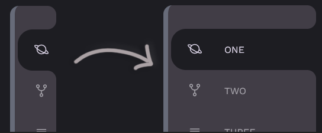

# curved-outside-sidebar

HTML/CSS+Sass/JS sidebar menu with curved outside boders on active tab.

Havin' fun with navigation bars with hover.

## You can see it for yourself right [:globe_with_meridians: HERE](https://warchalowski.pl/pro/curved-outside-sidebar/)

Curvature is generated using **box-shadow**s and **::before**, **::after** selectors.

### Credits

It's a mixup of [Online Tutorials](https://www.youtube.com/channel/UCbwXnUipZsLfUckBPsC7Jog) video tutorials, cheers :)
